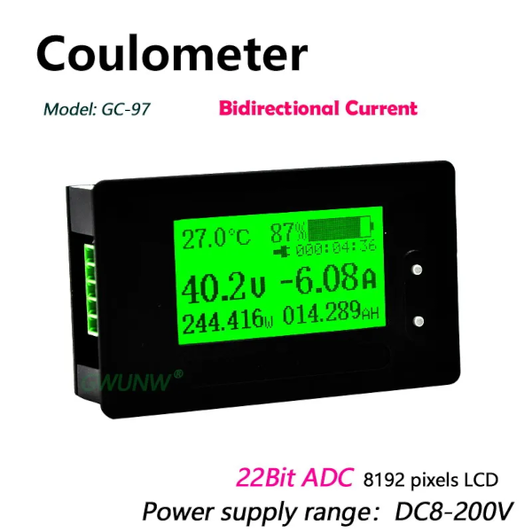
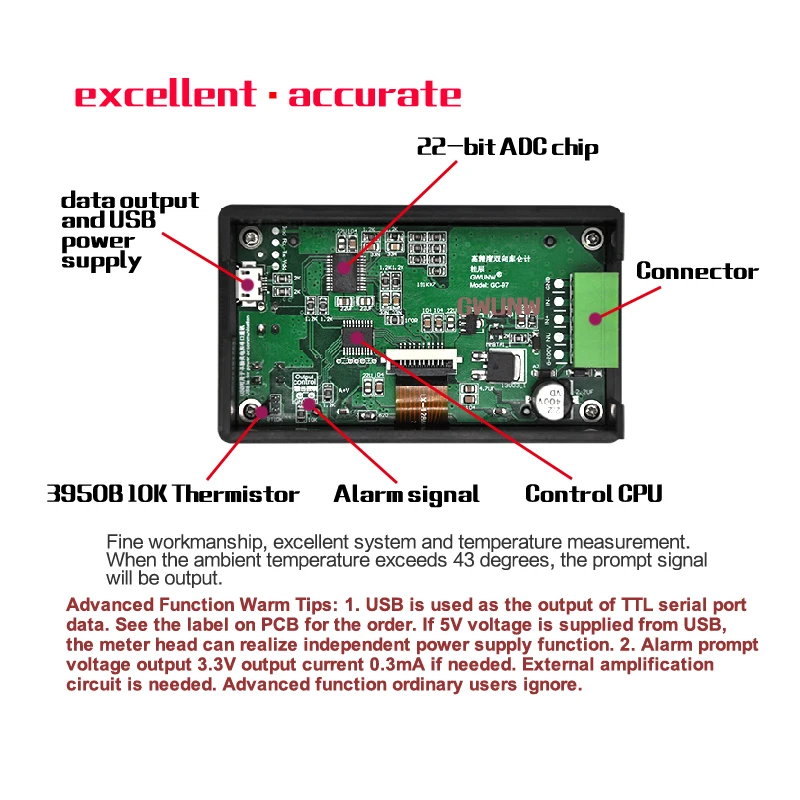

# GWUNW_GC97

## Python code to get data from GWUNW GC97 battery capacity indicator

Link to the device:
https://aliexpress.com/item/1005003378624928.html

## Overview

GC97 is a coulumb counter battery capacity indicator. Evaluation of Li-ion (LiFePO4, Li-poly) battery charge based on battery voltage is an inaccurate. To get reamain capacity need to count income and outcome current, the difference is a battery charge.

Originally I used GC97 as battery capacity indicator on my DIY power station. Now that battery is a UPS (uninterruptible power source) for my smart home controller.

GC97 has a UART interface. Data avilable over UART:
   - battery voltage
   - battery current
   - battery power
   - charging state (current direction)
   - available battery charge in Ah and %
   - internal temperature
   - time since start of loading or charging

All data available over UART is shown on the GC97 display. There is no extra information. Also battery settings are not available over UART.

## Requrements

This software is written for PC. Console application that receives data in a loop and prints battery status. Later I plan to add to AppDaemon in Home Assistant to see data on a dashboard.

To get it work you need:
   - GWUNW GC97 coulumb counter
   - USB-UART converter TTL 3.3V
   - PC to run application

Connect GC97 to UART converter is not a trivial task. You can either make custom micro USB cable or solder wires to dedicated pads on the board.
